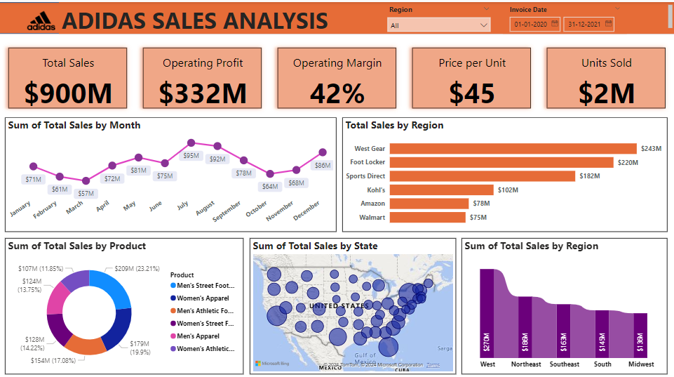

#  Adidas Sales Analysis Dashboard 📊

This project is a **Power BI Dashboard** created to provide a comprehensive analysis of Adidas sales data across various metrics, regions, and product categories. The dashboard delivers key insights through visually appealing and interactive elements, making it easy for stakeholders to make data-driven decisions.

## 🌟 Objectives

The primary goal of this project is to:

- 📈 Track **Total Sales**, **Operating Profit**, **Operating Margin**, **Price per Unit**, and **Units Sold**
- 🗓️ Analyze monthly sales trends
- 🌎 Examine sales by region, state, and product categories
- 🎯 Enable data slicing by region and date for customized insights

## 🖼️ Dashboard Highlights

1. **Top KPI Cards** 🎯  
   - Displays **Total Sales**, **Operating Profit**, **Operating Margin**, **Price per Unit**, and **Units Sold** to offer a quick overview of key performance metrics.

2. **Monthly Sales Trend** 📅  
   - A **line chart** titled "Sum of Total Sales by Month" provides a month-by-month view of sales trends, with data points labeled for each month.

3. **Sales by Region** 🌐  
   - A **bar chart** visual, "Total Sales by Region," showcases sales figures across different retailers like West Gear, Foot Locker, Sports Direct, etc.

4. **Product Category Breakdown** 🛍️  
   - A **donut chart** titled "Sum of Total Sales by Product" highlights sales distribution among product types, including Men's Street Footwear, Women's Apparel, and more.

5. **Geographic Sales by State** 🗺️  
   - A **map visualization** called "Sum of Total Sales by State" presents the geographical distribution of sales across different states in the U.S.

6. **Regional Sales Comparison** 📍  
   - A **bar chart** titled "Sum of Total Sales by Region" compares sales performance across U.S. regions (e.g., West, Northeast, Southeast, etc.).

7. **Interactive Filters** 🧩  
   - **Slicers** for **Region** and **Invoice Date** enable users to filter the dashboard by specific regions and time frames, providing a tailored view of the data.

## 📊 Data Fields Used

- **Top KPI Cards**:
  - **Total Sales**: Overall revenue generated.
  - **Operating Profit**: Earnings after operating expenses.
  - **Operating Margin**: Profitability percentage.
  - **Price per Unit**: Average price per unit sold.
  - **Units Sold**: Total units sold.

- **Visualizations**:
  - **Sum of Total Sales by Month**: Line chart for monthly sales.
  - **Total Sales by Region**: Bar chart by retailer.
  - **Sum of Total Sales by Product**: Donut chart by product category.
  - **Sum of Total Sales by State**: Map visual.
  - **Sum of Total Sales by Region**: Bar chart by U.S. regions.

## 🛠️ Tools & Technologies

- **Power BI** for creating data visualizations and dashboard design.

## 🎨 Color Coding

- **Orange** is used for the KPI cards, making the key metrics prominent at the top.
- **Purple** for the regional comparison bar chart, providing a visually distinct contrast.
- **Dark blue** for the highest values (e.g., highest sales and profit) in other visuals.
- **Light grey** for the lowest values, highlighting areas with lower performance.

## 📸 Dashboard Screenshot

## 📌 Conclusion

The **Adidas Sales Analysis Dashboard** provides actionable insights by visualizing sales and profit data across different metrics, time frames, and regions. This interactive dashboard is designed for business stakeholders to gain a deeper understanding of Adidas' sales performance and make informed, data-driven decisions.

---
